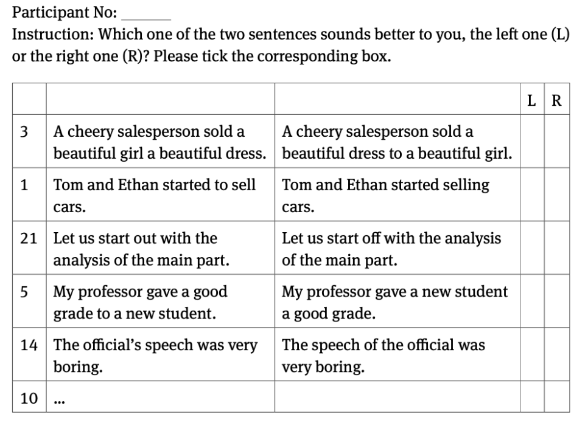

# "Introduction to English Linguistics"
## Chapter 2 - The sound system: phonology
### 2.1: Introduction
The introduction part outlines the fundamental concept of phonology as the study of abstract categories that organize the sound system of a language. Rather than merely perceiving or producing sound waves, speakers and listeners mentally categorize sounds into abstract units. Mastering this sound system is essential for speaking and understanding a language. Phonology encompasses individual speech sounds as well as their organization into larger units like syllables and words.

_The chapter's structure is detailed:_

- **Introduction to Phonology**: Using the English "r-sound" as an example, Section 2.2 will elucidate why abstract categories are necessary to describe the sound system of a language.

- **Methodology**: Section 2.3 will introduce the methodology used to determine which sounds are grouped into which categories in English.
- **Analysis of Phonemes**: Section 2.4 will analyze a selection of intriguing English phonemes based on the established methodology.

- **Syllable Structure**: Section 2.5 will focus on the syllable as a higher-level phonological unit that organizes sounds in spoken language.

This introduction serves as a roadmap for understanding the principles and methods of phonological analysis, using the English language as an illustrative example. It emphasizes the abstract nature of phonological categories and their crucial role in organizing and comprehending spoken language.

### 2.2: Introducing order into the chaos: the phoneme
The subchapter 2.2 discusses the perception of the sound [ɹ] in various English words and introduces the concept of phonemes and allophones.

It begins by examining three words - "rip," "wrap," and "rope" - each containing the sound [ɹ]. Spectrogram images are provided to illustrate the acoustic properties of this sound. Despite differences in spectrograms, the sound [ɹ] is perceived similarly in all three words.

Next, the text compares the words "rip," "wrap," and "rope" to "trip," "trap," and "trope." Although all six words contain the letter "r," the sound [ɹ] is not uniformly present. Spectrogram analysis reveals distinct acoustic patterns between the two sets of words. Additionally, a tactile experiment involving the larynx highlights differences in the production of the [ɹ] sound.

The concept of phonemes is introduced as abstract mental categories that organize speech sounds. Phonemes are contrasted with phones, which are physical realizations of speech sounds. Allophones are phones that function as alternative realizations of the same phoneme.

This subchapter then discusses transcription methods, including narrow transcription, which provides detailed articulatory information. It emphasizes the use of phonetic evidence rather than orthography in analyzing sound structures.

Furthermore, the text explores the complementary distribution of allophones, using the example of [ɹ] and [ɹ̥] in English. This distribution suggests that [ɹ] and [ɹ̥] are allophones of the same phoneme.

Finally, this part of the chapter draws an analogy between complementary distribution in linguistics and states of matter in chemistry. It concludes by posing questions about investigating phoneme systems in languages and the challenges posed by speakers' lack of awareness of these systems.

### 2.3: The key to finding the order

The text delves into strategies for investigating how languages categorize sounds into phonemes and allophones.

#### 2.3.1 Minimal Pairs:
The first strategy involves examining the system of phonemes and understanding what distinguishes it from a random collection of phones. Phonemes are defined as units that, when replaced, can change the meaning of a word, unlike allophones. For instance, replacing the English phoneme /ɹ/ in "wrap" with another phoneme yields a different word, while replacing its allophones ([ɹ] and [ɹ̥]) only results in ill-formed words. Minimal pairs, such as "lap" and "map," are used to illustrate this concept, where a single sound change alters the meaning.

#### 2.3.2 Distributional Characteristics of Allophones:
The second strategy examines the properties of allophones, focusing on complementary distribution and free variation. Allophones may exhibit complementary distribution, as seen in the distinct realizations of /p/ in word-medial and word-final positions. However, some allophones, like [p] and [p̚], show free variation, where speakers can choose between them without altering meaning. The text introduces systematic definitions and notational conventions for analyzing different phonetic contexts within words.

#### 2.3.3 Observing Allophonic Alternations in Different Word Forms:
The third strategy involves analyzing different word forms to observe alternations between allophones. By changing word forms, phonetic contexts can be manipulated to reveal different allophones. For example, the English verb "clap" exhibits a released [p] in its infinitive form but an unreleased [p̚] in its present participle form "clapping." Similarly, in German, the words "Rad" and "Rat" appear to end in the same sound, but analyzing their plural forms reveals they belong to different phonemes (/d/ and /t/, respectively) due to alternations in word-final contexts.

The text concludes by emphasizing the methodological ground for investigating phoneme systems, highlighting the importance of minimal pairs tests, and the distributional characteristics of allophones in determining phoneme status. It previews the application of these strategies to further explore the phoneme inventory of English.

### 2.4: More about the sound system of English
This section delves into the intricacies of English phonology, focusing on the allophones (different realizations) of specific sounds like /l/ and /r/ in various phonetic contexts.

**Allophones of /l/:**

/l/ has three main realizations: [l], [l̥], and [ɫ].
[l] is the voiced allophone, occurring initially in words like "lap."
[l̥] is the voiceless allophone, occurring after voiceless stops, as in "clap."
[ɫ] is the velarized or "dark" allophone, found in word-final positions, sounding darker than [l].
The distinction between "clear" [l] and "dark" [ɫ] lies in the position of the tongue, with [ɫ] involving the raising of the back of the tongue towards the velum.
The distribution of [ɫ] and [l] is complementary, meaning they don't occur in the same phonetic context. [:] is found word-finally, while [l] occurs word-initially and between vowels.
The presence of [ɫ] and [l] can be determined through complementary distribution rather than free variation, as they never occur together.

**Stop Phonemes:**

Stops like /p/, /t/, and /k/ have allophones including unreleased, aspirated, and non-aspirated variants.
Aspiration occurs mainly in word-initial positions or after /s/ before a vowel.
Aspirated stops are perceived as typical in English, leading to the misconception that unaspirated stops are voiced when heard in isolation.

**Complex Case of /r/:**

/r/ has various allophones, including a tap ([ɾ]) and [r].
Between vowels, /r/ can be realized as either [ɾ] or [r], but these variations don't affect meaning.
In RP English, /r/ tends not to be pronounced in word-final positions, making it a non-rhotic variety.
However, /r/ is not absent in these contexts but rather not pronounced.
Allophones of /r/ vary depending on phonetic contexts, including [ɾ], [r], or even a zero allophone in some cases.
The presence or absence of /r/ in various phonetic contexts can be determined through complementary distribution.
Rhotic varieties, like General American English, pronounce /r/ consistently in word-final positions.

### 2.5: The Syllable

#### 2.5.1: The Structure of the Syllable
Spoken language doesn't consist solely of individual sounds but organizes them into higher-level units, one of which is the syllable. Familiar from school days, the syllable intuitively describes the phonological form of words. English and German data exemplify truncation processes, revealing differences in syllable count between languages. Syllables typically contain a vowel and optional consonants before and/or after the vowel, forming a structure with nucleus and optional onset and coda.

#### 2.5.2: Syllabification
Syllabification involves distributing consonants among syllables. The Maximal Onset Principle asserts that consonants tend to be syllabified in onsets rather than codas. The Sonority Sequencing Principle dictates that sonority rises towards the nucleus and falls away from it. This principle, alongside the Maximal Onset Principle, explains why certain consonant sequences are disallowed in onsets or codas across languages, shedding light on syllable structures and phonological processes.

#### 2.5.3: The Syllable and Allophonic Processes
Revisiting allophonic processes, particularly the distribution of clear and dark /l/, through syllable boundaries provides insights. The syllable-based generalization simplifies and enhances predictions regarding allophonic variations, demonstrating the importance of syllabic structures in phonological analyses.

### 2.6: Conclusion
Chapter 2.5 delves into the structure and significance of syllables in phonological analysis. It demonstrates how syllables offer a framework for understanding allophonic processes and phonological phenomena, highlighting their crucial role in linguistic description and analysis.

### Further Reading
For a deeper understanding of English phonology and its variations across different varieties, we recommend the following texts:

- Carr (2013)
- Giegerich (1992)
- McCully (2009)
- Yavas (2011)

These texts cover phonological argumentation, phonetic fundamentals, and second language phonology. Additionally, accessible introductions to phonology, including discussions on various languages' phenomena, can be found in:
- Roca and Johnson (1999)
- Spencer (1996)

## Chapter 8 - Linguistics as an empirical science
### 8.1: Introduction

Chapters 1 through 7 introduced **foundational linguistics concepts** and various areas of **linguistic research**, emphasizing the analysis of **words, sentences, and utterances**. Exercises included small-scale research tasks to illustrate **empirical linguistic research methods**. The upcoming chapter shifts focus to **linguistics as an empirical science**, presenting modern **research methods** through small-scale studies in **morphology** and **syntax**. It will introduce **research questions** and essential **statistical tools** for **data analysis**, preceded by a discussion on challenges in initiating empirical studies.

### 8.2: How to do empirical research in linguistics

**Research** involves systematically and transparently seeking knowledge to answer specific, often unanswered questions known as **research questions**. This process starts with formulating a manageable and clear research question, which can then be broken down into smaller, investigable components. For example, Trudgill's study on language use examined how **social class** and **style** influence the choice between the **\[ɪŋ\]** and **\[ɪn\]** allomorphs of the suffix **\-ing**.

To address research questions, researchers:

1.  Collect and **code data**, classifying it according to relevant factors.
2.  Analyze data **statistically** to test **hypotheses**, which are statements predicting relationships or effects.
    *   **Null hypotheses** predict no effect and are often tested to be potentially falsified.

For Trudgill, the hypothesis was that social class and style affect language use, which was supported by the data.

**Data collection methods** include:

*   **Linguistic corpora**: Large, structured collections of texts or speech.
*   **Experiments**: Controlled data collection procedures.

Each method has its advantages and challenges:

*   Corpora offer **authentic data**.
*   Experiments provide **specific, controlled insights**.

Proper **statistical analysis** is crucial to determine whether observed patterns are meaningful or due to chance.

### 8.3: A corpus-based study in morphology: 
_who_ or _whom_, that is the question
Chapter 4.3 explores the inflectional forms of **pronouns**, particularly focusing on third-person personal pronouns like "he" and "him." It discusses the parallels in behavior between pronoun pairs like "he/him," "she/her," "we/us," and "they/them," extending to **relative pronouns** like "who" and "whom." The chapter delves into understanding **relative clauses**, defining them as **subordinate clauses** that modify nouns and are introduced by **relative pronouns**.

The text addresses the research question of when to use "**who**" versus "**whom**" in relative pronoun contexts, proposing **hypotheses** based on syntactic functions. It references grammar books like Huddleston and Pullum (2005) and Quirk et al. (1985) to glean insights into the distribution and formality of "**who**" and "**whom**."

To empirically test **hypotheses**, the text suggests utilizing **corpus linguistics**, particularly the **Corpus of Contemporary American English (COCA)**. It outlines a method for searching COCA for relevant examples of **relative clauses** with "**who**" and "**whom**" as **object pronouns**. The **data collection process** involves analyzing sentences from COCA and categorizing them based on **syntactic structures** and **register classifications**.

The chapter emphasizes the importance of **systematic data coding**, ensuring that only relevant examples are included in the analysis. It discusses challenges such as ambiguous interpretations and provides strategies for handling them, including the introduction of new **variables** for tracking inclusion criteria.

The process of analysis begins with a spreadsheet containing **_251 observations_**, each representing a sentence from the COCA database, along with **_coded properties or measurements_**. After filtering out irrelevant observations, **_246 fully coded items_** remain for analysis.

Testing hypothesis (7a) involves comparing the frequencies of the pronouns "**_who_**" and "**_whom_**" in the dataset. A statistical approach using **_chi-square testing_** is preferred over manual counting due to its efficiency and reliability. Results from **_Table 8.1_** and **_Figure 8.2_** indicate a significant difference, with "**_whom_**" being more frequent than "**_who_**".

To determine the meaningfulness of this difference, **_chi-square values_** are computed, indicating the discrepancy between observed and expected frequencies. The procedure involves **_squaring the differences_** and computing proportions. A simulation experiment generates chi-square values under chance conditions, establishing the probability distribution of such values.

Comparing these distributions validates the observed difference as **_highly significant_**, leading to the rejection of **_hypothesis (7a)_**. The interpretation challenges previous claims about the frequency and correctness of "**_who_**" versus "**_whom_**". Further analysis explores the relationship between pronoun usage and **_register_**, confirming **_hypothesis (7b)_** with statistical significance.

In conclusion, the study provides **_substantial evidence_** against the initial hypothesis, demonstrating a preference for "**_whom_**" over "**_who_**" in object relative pronoun usage, particularly in formal contexts. Statistical tests support these findings, suggesting a consistent trend that extends beyond random variation. Future research may explore the generalizability of these results to different linguistic contexts.

#### 8.4 An experimental study in syntax: the dative alternation

The text outlines a study on ditransitive verbs, which take two objects, and examines the choice between two constructions: the double object construction (e.g., "She gave [the woman] [the letter]") and the prepositional object construction (e.g., "She gave [the letter] [to the woman]"). Examples from COCA and modified versions highlight these alternatives. The study aims to determine why speakers prefer one construction over the other. It posits that factors like the length of the objects and the verb type (e.g., "give" vs. "sell") influence this preference.

To investigate this, an acceptability judgment task was designed, asking participants to rate the acceptability of sentence pairs. The experiment controls for other influential factors by ensuring the objects in the test sentences are of equal length and have a parallel structure. The questionnaire uses filler items and randomizes the order to prevent participants from identifying the study's focus. The ultimate goal is to determine if the verb type influences the choice between the two constructions, formulating and testing the hypothesis through empirical data collection and analysis.

The authors describe the methodology and analysis of a questionnaire-based experiment to study preferences between two constructions of ditransitive verbs: the double object construction (e.g., "gave [her] [a book]") and the prepositional object construction (e.g., "gave [a book] [to her]"). Participants were asked to indicate which construction they found more acceptable for each sentence pair. The questionnaire included randomized items with ID numbers to track responses.

The experiment aimed to determine if the choice of construction depends on the verb ("give" or "sell"). The data from 16 participants (160 observations) were analyzed using a spreadsheet, tracking variables like participant ID, sentence ID, verb, and preference. The main hypothesis was that verb type influences the construction preference.

Analysis using contingency tables and a chi-square test revealed that although there was a slight preference for the double object construction with "give" over "sell," the difference was not statistically significant. Thus, the hypothesis that verb type determines construction preference was not supported by the data.

Summing up, this chapter introduced two key empirical methods in modern linguistic research: corpus studies and experiments. It discussed the tools available, such as electronic corpora and analytical software, for solving linguistic problems. The chapter covered the development of research questions and hypotheses, data collection methods, and the use of statistical tests to validate hypotheses and intuitions based on data distribution.

